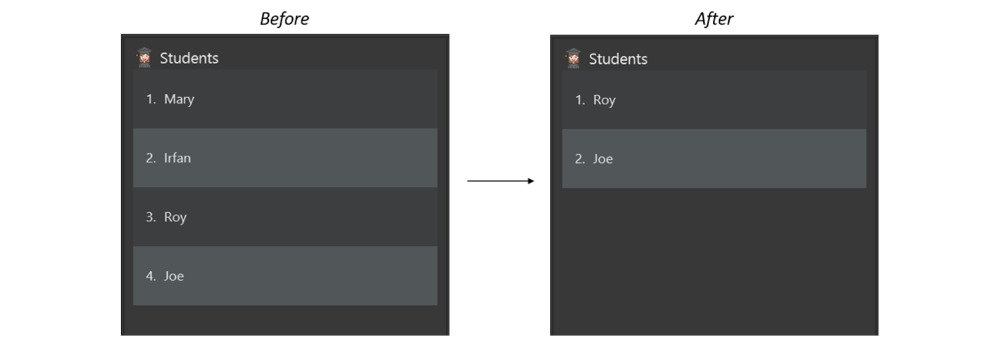

<p align="center">
 
</p>

Welcome to the _TutAssistor User Guide_! Simply choose a topic below to find answers, learn about the features, and manage tutoring better.

<div style="page-break-after: always;"></div>

# Table of Contents
1. [Introduction](#1-introduction)

    1.1 [What is TutAssistor?](#11-what-is-tutassistor)
    
    1.2 [What can TutAssistor do for you?](#12-what-can-tutassistor-do-for-you)
    
    1.3 [How to use this guide?](#13-how-to-use-this-guide)

2. [Get started](#2-get-started)

    2.1 [Installation guide](#21-installation-guide)
    
    2.2 [Try it yourself!](#22-try-it-yourself)

3. <details open><summary><a href="#3-features">Features</a></summary><br>
    3.1 <a href="#31-add-studenttuition-class">Add student/class</a><br><br>
    3.2 <a href="#32-view-studenttuition-class">View student/class</a><br><br>
    3.3 <a href="#33-edit-studenttuition-class">Edit student/class</a><br><br>
    3.4 <a href="#34-delete-studenttuition-class">Delete student/class</a><br><br>
    3.5 <a href="#35-addremove-student-from-class">Add/Remove student from class</a><br><br>
    3.6 <a href="#36-add-remark-to-studenttuition-class">Add remark</a><br><br>
    3.7 <a href="#37-find-studenttuition-class">Find students/classes</a><br><br>
    3.8 <a href="#38-list-all-studentstuition-classes">List students/classes</a><br><br>
    3.9 <a href="#39-sort-tuition-classes-sort--s">Sort classes</a><br><br>
    3.10 <a href="#310-view-timetable-timetable--tt">View timetable</a><br><br>
    3.11 <a href="#311-view-todays-classes-today--td">View today's classes</a><br><br>
    3.12 <a href="#312-view-help-help--h">View help</a><br><br>
    3.13 <a href="#313-navigate-input-history">Navigate Input History</a><br><br>
    3.14 <a href="#314-clear-data-clear">Clear data</a><br><br>
    3.15 <a href="#315-exit-the-app-exit">Exit the program</a><br><br>
    3.16 <a href="#316-track-payment-coming-in-v20" markdown="1">Track payment `coming in v2.0`</a><br></details><br>

4. <details open><summary><a href="#4-additional-command-format-information">Additional Command Format Information</a></summary><br>
    4.1 <a href="#41-name">Name</a><br><br>
    4.2 <a href="#42-phone-number">Phone Number</a><br><br>
    4.3 <a href="#43-email">Email</a><br><br>
    4.4 <a href="#44-timeslot">Timeslot</a><br><br>
    4.5 <a href="#45-index">Index</a><br></details><br>

5. [FAQ](#5-faq)

6. [Command Summary](#6-command-summary)

--------------------------------------------------------------------------------------------------------------------
<div style="page-break-after: always;"></div>

## 1 Introduction

### 1.1 What is TutAssistor?
Welcome to the user guide of TutAssistor!

Are you a private tutor struggling to keep track of all your classes and students? Do you spend
countless hours on administrative duties such as scheduling classes and updating numerous students' records?

If the above situation sounds familiar to you, fret not, **TutAssistor** is here to save the day!

**TutAssistor** is a ***desktop app intended for private tutors like yourself to
manage their students and classes, and it is optimized for use via a Command Line Interface (CLI)***.

**TutAssistor** uses Command Line Interface (CLI); this means that you operate the application by typing commands into a Command Box.
If you are a fast typer, you can operate the application more easily and faster than
Graphical User Interface (GUI) applications; GUI applications allow users to interact
with the application via graphical icons such as buttons.

You do not have to worry at all even if you are new to CLI applications as
this user guide will take you through step by step on how various
features of **TutAssistor** can be utilised, all directed towards
providing the best possible experience to the user.

### 1.2 What can TutAssistor do for you?

TutAssistor provides an all-in-one platform for you to manage information
regarding your students and lessons stress-free and efficiently. In the latest version, we offer you the ability to:

* Track student details
* Keep student details up-to-date
* Resolve conflicting time slots of tuition classes
* Efficiently create notes for each class/student
* View scheduled lessons in a timetable

<div style="page-break-after: always;"></div>

### 1.3 How to use this guide?

#### Structure of this document

We have structured this User Guide in a way to help you find what you need easily and quickly. In the next subsections, you will learn about how features are formatted and meanings of several symbols used in later sections. Section 3 - [Features](#3-features), documents the main features of TutAssistor and provides explanations on how to utilise them.


#### Step-by-step guide for each feature

The features in this guide are formatted with the following conventions:

* **Command Keyword** - Each feature is executed by a command keyword. The shortcut for each command is shown together with its full command keyword separated by the <code>&#124;</code> symbol. You can use the command shortcuts to reduce typing.
* **Command Format** - Each command is accompanied by a set of information that you provide. Refer to the [Features](#3-features) below for details of each command.
* **Examples** - Possible usage of each feature is provided. You may follow these examples when familiarising with the app.
* **Screenshots** - A visualisation of the expected outcome is provided for some features.

### Technical terms

The table below explains some technical terms that you may come across throughout the user guide.

| Term |  What it means |
|:----------:|-------------|
| CLI |  The Command-Line Interface (or CLI for short) is the user interface that is used by TutAssistor. Unlike traditional Graphical User Interface (GUI) base applications, it may be less intuitive to new users. However upon familiarisation, fast typists may find it faster to use.  |
| Command word| The Command word refers to the keywords which TutAssistor recognises to invoke specific commands. These command words will be indicated by `COMMAND WORD` in the various sections below.|
|Parameter|Parameter refers to the user input required after the user is prompted by TutAssistor|


#### General symbols and syntax used in this guide

For additional information accompanying each segment, look for the following symbols:

Syntax | What it means
-------|--------
&emsp; :information_source: | Precedes information that is useful to remember.
&emsp; :bulb: | Precedes information that serves as tips for a feature.
&emsp; :warning: | Precedes information as an important warning.


Jump right in to the next section: [2 Get Started](#2-get-started) to get you started!

--------------------------------------------------------------------------------------------------------------------
<div style="page-break-after: always;"></div>

## 2 Get Started

This section gives you step-by-step instructions on how to download and open the application.

### 2.1 Installation guide

#### For Windows
1. Ensure you have Java 11 or above installed in your Computer. You may install it [here](https://www.oracle.com/java/technologies/downloads/).
2. Download the latest TutAssistor release from [our github site](https://github.com/AY2122S1-CS2103T-T12-4/tp/releases).
3. Double click the downloaded `Tutassistor.jar` file to launch TutAssistor.

#### For Mac
1. Ensure you have Java 11 or above installed in your Computer. You may install it [here](https://www.oracle.com/java/technologies/downloads/).
2. Download the latest TutAssistor release from [our github site](https://github.com/AY2122S1-CS2103T-T12-4/tp/releases).
3. Open Terminal.
4. Change the active directory to the location of `Tutassistor.jar`.

For example,

 ```
 cd Downloads
 ```
4. Run the following command.

 ```
 java -jar TutAssistor.jar
 ```
<div style="page-break-after: always;"></div>

After launching the app, the GUI similar to the one shown below should appear in a few seconds. Note how the app contains some sample data.

<p align="center"><i>Figure 1: GUI of TutAssistor</i></p>

Component | What it does
-------|--------
Menu Bar | Exits TutAssistor or views help.
Command Box | Key in commands.
Result Display Pane | Displays feedback of commands.
TuitionList Panel | Displays all tuition classes.
StudentList Panel | Displays all students.
Main Display Pane | Displays classes scheduled today, details of students and classes, or a timetable.


### 2.2 Try it yourself!

Once you have installed the latest TutAssistor, why not give it a try?

Type the command in the command box and press Enter to execute it. e.g. typing help and pressing **Enter** will open the help window.

Some example commands you can try:

* `student 1`: Views the first student shown in the student list.
* `add n/John Doe p/98765432 e/johnd@example.com a/John street, block 123, #01-01`: Adds a student named `John Doe` to TutAssistor.
* `addtoclass si/3 tc/1`: Adds the 3rd student in the student list to the 1st class in the tuition class list.
* `deleteclass 2`: Deletes the 2nd class shown in the tuition class list.
* `clear`: Deletes all students and classes. Note that this action is irreversible.
* `exit`: Exit TutAssistor.

Now that you are more familiar with our app, make it yours! Head over to section [3 Features](#3-features) to learn more about the features TutAssistor can offer you!

--------------------------------------------------------------------------------------------------------------------
<div style="page-break-after: always;"></div>

## 3 Features

This section contains all the information about the features of **TutAssistor**. You may enter a command into the CLI to use each feature.


<div markdown="block" class="alert alert-info">

**:information_source: Notes about the command format:**<br>

* Words in `UPPER_CASE` are the parameters to be supplied by the user.<br>
  e.g. in `add n/NAME`, `NAME` is a parameter which can be used as `add n/John Doe`.

* Items in square brackets are optional.<br>
  e.g `n/NAME [r/REMARK]` can be used as `n/John Doe r/student` or as `n/John Doe`.

* Items with `…`​ after them can be used zero or more times.<br>
  e.g. `si/STUDENT_INDEX [STUDENT_INDEX]…​` can be used as ` ` (i.e. 0 times), `si/1`, `si/1 2 3` etc.

* Parameters can be in any order.<br>
  e.g. if the command specifies `n/NAME p/PHONE_NUMBER`, `p/PHONE_NUMBER n/NAME` is also acceptable.

* If a parameter is expected only once in the command but you specified it multiple times, only the last occurrence of the parameter will be taken.<br>
  e.g. if you specify `p/12341234 p/56785678`, only `p/56785678` will be taken.

* Extraneous parameters for commands that do not take in parameters (such as `help`, `list`, `exit` and `clear`) will be ignored.<br>
  e.g. if the command specifies `help 123`, it will be interpreted as `help`.

Refer to the [Additional Command Format Information](#4-additional-command-format-information) under section 4 to learn the requirements of the various parameters used.

</div>

<div style="page-break-after: always;"></div>

### 3.1 Add student/tuition class
#### Adding a student: `add` | `a`
You can add a student with his/her specified information such as name, phone number, email and address.

<div markdown="span" class="alert alert-primary" markdown = "1">:bulb: **Tip:**
[Read more on the requirements of the various parameters used.](#4-additional-command-format-information)
</div>

Usage scenario:
* You want to register a new student who wants to enrol in one of your classes.

Format: `add n/NAME p/PHONE_NUMBER e/EMAIL a/ADDRESS [r/REMARK]`

Examples:

```
add n/John Doe p/98765432 e/johnd@example.com a/John street, block 123, #01-01
```
```
a n/Tom Ng p/97865342 e/tomng@eg.com a/221B Baker St r/Can only attend on even weeks
```
<p align="center">
  <br>
  <i>Figure 2: Add a new student</i>
</p>

<div markdown="span" class="alert alert-primary">
:information_source: Note: `James Yeoh` and  <code>james &nbsp; yeoh</code> are considered the same person, namely `Name` is case-insensitive and the differences in whitespaces would not be considered.
</div>

<div style="page-break-after: always;"></div>

#### Adding a tuition class: `addclass` | `ac`
You can add a tuition class with a limit for student capacity at a specified [timeslot](#44-timeslot). TutAssistor will notify you if there are any conflicting time slots with existing classes.

Usage scenario:
* You want to create a new Math class for your students.

Format: `addclass n/NAME l/LIMIT ts/TIMESLOT [s/NAME,NAME,NAME...] [r/REMARK]`

* It is optional to add students into the class when creating a tuition class. See [`addtoclass`](#31-add-studenttuition-class) for more information.
* The [timeslot](#44-timeslot) should follow the format "Ddd HH:mm-HH:mm".
* The limit of a class should be more than 0 and should not exceed 1000.

<div markdown="span" class="alert alert-primary">:bulb: **Tip:**
There should not be a space after each comma when listing multiple students.
</div>

Examples:
```
addclass n/Chemistry l/16 ts/Thu 15:00-17:00 s/Bernice Yu,Richard Ng
```
```
ac n/Math l/8 ts/Mon 11:00-14:00 r/Quiz on final lesson
```
<div style="page-break-after: always;"></div>

### 3.2 View student/tuition class
You can view all the details of a specified student or class in the information page.

#### 3.2.1 Viewing a student: `student` | `vs`

Usage scenario:
* You want to obtain all the details of a particular student.

Format: `student INDEX`

Example:
```
student 2
```
or
```
vs 2
```

<p align="center">
  <br>
  <i>Figure 3: Displaying a student's details in the information page</i>
</p>

<div style="page-break-after: always;"></div>

#### 3.2.2 Viewing a tuition class: `class` | `vc`

Usage scenario:
* You want to obtain all the details of a particular class.

Format: `class INDEX`

Example:
```
class 3
```
or
```
vc 3
```
<p align="center">
  <br>
  <i>Figure 4: Displaying details of a class in the information page</i>
</p>

<div style="page-break-after: always;"></div>

### 3.3 Edit student/tuition class
You can edit details of an existing student or tuition class.

<div markdown="span" class="alert alert-primary">
:information_source: Note: At least one parameter must be provided.
</div>

#### Editing a student: `edit` | `e`

Usage scenario:
* You realise that you entered the phone number of a student wrongly and want to rectify it.

Format: `edit INDEX [n/NAME] [p/PHONE] [e/EMAIL] [a/ADDRESS]`

Examples:
```
edit 1 n/Jason Tan a/221b Baker Street
```
or
```
e 1 n/Jason Tan a/221b Baker Street
```

<div markdown="span" class="alert alert-primary">
:information_source: Note: The edited name must be unique and should not be the same name of another existing student.
</div>


#### Editing a class: `editclass` | `ec`

Usage scenario:
* You want to change the timing of a particular class.
* You wish to update the name of a class.

Format: `editclass INDEX [n/NAME] [l/LIMIT] [ts/TIMESLOT]`

Examples:
```
editclass 1 n/Math ts/Wed 10:00-12:00
```
or

```
ec 1 n/Math ts/Wed 10:00-12:00
```
<br>
<div markdown="span" class="alert alert-primary">
:information_source: Note: The edited timeslot cannot conflict with an existing timeslot of another class. See [timeslot](#44-timeslot) for more information.
</div>
<br>

<div style="page-break-after: always;"></div>

An example output of using the `editclass` command is shown below:

<p align="center">
  <br>
  <i>Figure 5: Example of executing `editclass 1 n/Math ts/Wed 10:00-12:00` command</i>
</p>

<div style="page-break-after: always;"></div>

### 3.4 Delete student/tuition class
You can delete multiple students and tuition classes from TutAssistor.

* At least one student or class index must be provided.

* Provide multiple indices to delete multiple students or classes at once.

<div markdown="span" class="alert alert-primary">
:warning: THIS COMMAND IS IRREVERSIBLE. IT WILL DELETE ALL DATA OF THE IDENTIFIED STUDENT OR CLASS.
</div>

#### Deleting students: `delete` | `del`

Usage scenario:
* You would like to remove a student who has dropped out of all your classes.

Format: `delete STUDENT_INDEX [STUDENT_INDEX]...`

Example:
```
delete 1 2
```
or

```
del 1 2
```
An example output of using the `delete` command is shown below:

<p align="center">
  <br>
  <i>Figure 6: Example of executing `delete 1 2` command</i>
</p>

#### Deleting tuition classes: `deleteclass` | `delc`

Usage scenario:
* You would like to delete a class that is not popular among your students.

Format: `deleteclass CLASS_INDEX [CLASS_INDEX]...`

Example:
```
deleteclass 1 2
```
or

```
delc 1 2
```

<div style="page-break-after: always;"></div>

### 3.5 Add/Remove student from class

You can add students to an existing class. Similarly, you can remove students enrolled in a class as well.

#### Adding existing students to a class: `addtoclass` | `atc`

You can add one or more students to an existing class.

<div markdown="block" class="alert alert-primary">

:information_source: Note: When adding multiple students at once:<br>

* use commas(`,`) to separate names, with no spaces after each comma.

* use spaces to separate indices.

</div>

Usage scenario:
* You would like to enrol a student into a particular class.

Format:

`addtoclass si/STUDENT_INDEX [STUDENT_INDEX]... tc/CLASS_INDEX`

or

`addtoclass s/NAME[,NAME,NAME...] tc/CLASS_INDEX`

Examples:
```
addtoclass si/1 tc/1
```
```
atc si/1 2 3 4 tc/1
```
```
addtoclass s/James,Felicia tc/2
```
```
atc s/James tc/3
```
<div style="page-break-after: always;"></div>

The following is an example for `atc si/2 4 tc/1`.

<p align="center">
  <br>
  <i>Figure 7: Example of executing `atc si/2 4 tc/1` command</i>
</p>


#### Removing existing students from a class: `remove` | `rm`

You can remove existing students from a tuition class.

Usage scenario:
* You would like to update the students in a particular class, as a few students have dropped out of the class.

Format: `remove si/STUDENT_INDEX [STUDENT_INDEX]... tc/CLASS_INDEX`

Examples:
```
remove si/1 tc/1
```
```
rm si/1 2 3 4 tc/2
```

<div style="page-break-after: always;"></div>

### 3.6 Add remark to student/tuition class

#### Adding remark to a student: `remark` | `re`

You can add remarks to a student.

Usage scenario:
* You would like to set a reminder for a student who has yet to pay tuition fees.

Format: `remark STUDENT_INDEX`

Example:
```
remark 2
```
or
```
re 2
```
<div style="page-break-after: always;"></div>

#### Adding remark to a tuition class: `remarkclass` | `rec`

You can add a remark for a tuition class.

Usage scenario:
* You would like to remind yourself of the homework that is due for a class.
* You would like to keep track of the topics covered for a class.

Format: `remarkclass CLASS_INDEX`

Example:
```
remarkclass 2
```
or
```
rec 1
```

<div markdown="span" class="alert alert-primary">
:information_source: Note: When creating a new student or tuition class using the `add` and `addclass` commands, you can use the optional `r/REMARK` parameter to add remarks directly.
</div>


Upon entering the `remark` or `remarkclass` command, a pop-up window with a text box is displayed for you to add, edit or remove remarks.

<div markdown="span" class="alert alert-primary">:bulb: **Tip:**
To remove the remark, simply enter an empty remark and press `OK`. If you choose not to edit the remark, press `Cancel` to close the editor window.
</div>

<p align="center">
  <br>
  <i>Figure 8: Editing remarks with editor window</i>
</p>

<div markdown="span" class="alert alert-primary">
:warning: For MacOS users, the remarks editor may open as a new tab instead of a window, which can cause the buttons to be not displayed correctly. To open the editor as a new window instead, go to System preferences > General > Prefer tabs and choose never.
</div>

<div style="page-break-after: always;"></div>

### 3.7 Find student/tuition class
You can filter the list of students and classes based on the given keywords. The keywords are case-insensitive.
<div markdown="span" class="alert alert-primary">
:information_source: Note: Keywords will be matched entirely.
Example: A command `findclass phys` will not filter physics classes.
</div>

#### Finding students by name: `find` | `f`
You can search and find students using keywords.

Usage scenario:
* You would like to locate a student named `John`.

Format: `find KEYWORD [KEYWORD]...`

Example:
```
find alice tan
```
or
```
f alice tan
```
TutAssistor will display a list of all students with `alice` or `tan` in their name.

<div style="page-break-after: always;"></div>

#### Finding classes by name: `findclass` | `fc`

You can search and find tuition classes using keywords.

Usage scenario:
* You would like to locate all the Math classes in your list of tuition classes.

Format: `findclass KEYWORD [KEYWORD]...`

Example:
```
findclass physics chemistry
```
or
```
fc physics chemistry
```
TutAssistor will display a list of all classes with `physics` or `chemistry` in their name.

The filtered list should look similar to the example shown below:

<p align="center">
  <br>
  <i>Figure 9: Example of executing `find alice tan` command</i>
</p>

### 3.8 List all students/tuition classes
Shows the full list of students or classes.

#### Listing all students: `list` | `l`

You can view all the students in TutAssistor.

Usage scenario:
* You would like to have an overview of all your students.

Format: `list`

#### Listing all classes: `listclass` | `lc`

You can view all the tuition classes in TutAssistor.

Usage scenario:
* You would like to have an overview of all your classes.

Format: `listclass`

### 3.9 Sort tuition classes: `sort` | `s`

Sorts tuition class list according to time or alphabetical order.
* After the user executes the `sort` command, the list will continue to remain sorted even after adding or editing classes.
* The list will not be automatically sorted upon restarting TutAssistor, i.e., the user will have to execute the `sort` command again.

The possible usages of `sort` are given below:
* `sort` sorts by time
* `sort o/asc` sorts by ascending alphabetical order
* `sort o/desc` sorts by descending alphabetical order
* `sort o/time` sorts by time

<div markdown="block" class="alert alert-primary">

:information_source: Note: <br>

* For alphabetical order, the sorting is case-insensitive. For example, `chem` is considered the same as `Chem`.

* For time order, the sorting assumes Gregorian calendar format. i.e., Sunday is considered the start of a week and
  Saturday is considered the end of a week.

</div>

An example output of the `sort` command is shown below:

<p align="center">
  <br>
  <i>Figure 10: Example of executing `sort o/asc` command</i>
</p>

<div style="page-break-after: always;"></div>

### 3.10 View timetable: `timetable` | `tt`
You can view all classes scheduled this week in a timetable.

Usage scenario:
* You would like to have an overview of all the classes in a week.

Format:
```
timetable
```
<div markdown="block" class="alert alert-primary">

:information_source: Note: <br>

If a lesson is shorter than one hour, the timetable may not display its details properly, as it uses a smaller font size or omits the details completely due to limited space available in the time block.

For example, in Figure 11 below, the class on Monday, 15:00-15:15 is only 15 minutes long and therefore is not displayed with details such as the name and timeslot.
</div>

<p align="center">
  <br>
  <i>Figure 11: A timetable view of all tuition classes in a week</i>
</p>

<div style="page-break-after: always;"></div>

### 3.11 View today's classes: `today` | `td`
You can view all classes scheduled today. <br>
Additionally, a reminder of classes scheduled today will be displayed on the MainWindow when you open TutAssistor.

Usage scenario:
* You want to prepare the materials for all the upcoming classes today.

Format:
```
today
```
An example of the `today` command is shown below:

<p align="center">
  <br>
  <i>Figure 12: The view of all classes scheduled today in the Main Display Pane</i>
</p>

<div style="page-break-after: always;"></div>

### 3.12 View help: `help` | `h`

If you are unsure of the format of any command, you may view a command summary, as well as a link to the user guide using the `help` command. <br>

Usage scenario:
* You are new to the app and want to learn the basic commands.

Format: `help`

An example output of the `help` command is shown below:

<p align="center">
  <br>
  <i>Figure 13: The help window</i>
</p>

<div style="page-break-after: always;"></div>

### 3.13 Navigate command history

When typing in the command box, you can use the **up** and **down** arrow keys to access and navigate through previously entered commands.

### 3.14 Clear data: `clear`
You can clear the data of all students and tuition classes.

Usage scenario:
* You wish to wipe out the current data and start afresh.

Format: `clear`

<div markdown="span" class="alert alert-primary">
:warning: THIS COMMAND IS IRREVERSIBLE. IT WILL DELETE ALL THE DATA OF EXISTING STUDENTS AND CLASSES.
</div>

### 3.15 Exit the app: `exit`

Exits TutAssistor.

Format: `exit`

### 3.16 Track payment `coming in v2.0`
_Details coming soon..._

--------------------------------------------------------------------------------------------------------------------
<div style="page-break-after: always;"></div>

## 4 Additional Command Format Information

The section explains the requirements of the various parameters used for the commands. Head back to [Features](#3-features) to refer to general notes on the command format.

### 4.1 Name

Student name is unique, i.e., there cannot be 2 or more students registered with the same name. TutAssistor ignores
letter case and trivial whitespaces when it checks for duplicate names.

Note that if you successfully add a student, the name will appear exactly as what you typed, including trivial whitespaces.

For example, when adding a new student, given an existing student named `John Doe`,

- Valid: `John Doe the Great`
- Invalid: `john doe`, <code>John &ensp; Doe</code>

Names for tuition classes may be reused.

For example, given an existing class named `Biology`, you may add a new class also named `Biology`.

### 4.2 Phone Number
Phone number should only contain digits, and should be at least 3 digits long.

<div style="page-break-after: always;"></div>

### 4.3 Email
Email should be of the format `local-part@domain` and adhere to the following constraints:
1. The `local-part` should only contain alphanumeric characters and these special characters, `+` `_` `.` `-`. The `local-part` may not start or end with any special characters.
2. This is followed by a `@` and then a `domain` name. The domain name is made up of domain labels separated by periods.
   The domain name must:
- end with a domain label at least 2 characters long
- have each domain label start and end with alphanumeric characters
- have each domain label consist of alphanumeric characters, separated only by hyphens, if any

### 4.4 Timeslot
Timeslot for classes follows the format:
```
Ddd HH:mm-HH:mm
```
where
- `Ddd` is the day of the week, **abbreviated to the first three letters, with only the first letter capitalised**.

Examples:
- Correct: `Mon`, `Tue`, `Wed`, `Thu`, `Fri`, `Sat`, `Sun`
- Incorrect: `mon`, `tuesday`, `WED`, `Thurs`, `Friday`, etc
- `HH:mm` is the time with 2 digits for the hour and 2 digits for the minute. The first time must be earlier in the day than the second time.

Examples:
- Correct: `09:00-14:30`
- Incorrect: `9:00-14:00`, `9am-2pm`, `9-2`, `09:00-08:00`

<div style="page-break-after: always;"></div>

### 4.5 Index
Index for a student or tuition class must be a positive integer, starting from `1`. It must not exceed the size of the list.

For example, if the list consists of `5` students/tuition classes:
- Correct: `1`, `2`, `3`, `4`, `5`
- Incorrect: `0`, `1.5`, `a`, `6`, etc.

--------------------------------------------------------------------------------------------------------------------
<div style="page-break-after: always;"></div>

## 5 FAQ

**Q**: Where is my data saved?<br>
**A**: When our app is first opened, it will create a folder named data in the same folder where the `tutassistor.jar` file is located.
This folder contains a file called `tutassistor.json` which contains all the details of your students and classes.

**Q**: How do I transfer my data to another Computer?<br>
**A**: Install the app in the other computer and overwrite the empty data file it creates with the file that contains the data of your previous TutAssistor home folder.<br>

**Q**: Do I lose all the details of classes and students when I close the application?<br>
**A**: All of your data is stored locally in a file under the data folder and will be loaded upon the next entry,
hence you do not lose any data.<br>

**Q**: What should I do if I am unsure of the command formats?<br>
**A**: Please type `help` to learn the command formats.<br>

**Q**: Can I restore my data if I accidentally delete it?<br>
**A**: No, `clear`, `delete`, and `deleteclass` commands are irreversible.<br>

**Q**: Can I export my timetable schedule from TutAssistor?<br>
**A**: Currently, we do not support exporting timetable. However, you can screenshot the timetable to store it locally.<br>

**Q**: Who can I contact for further assistant?<br>
**A**: If you need further assistance, please [email](mailto:e0564878@u.nus.edu) us.<br>

--------------------------------------------------------------------------------------------------------------------
<div style="page-break-after: always;"></div>

## 6 Command Summary

Head back up to section [3 Features](#3-features) to refer to notes about the command format.

Action | Format | Shortcut
-------|--------|---------
[***Add Student***](#31-add-studenttuition-class) | `add n/NAME p/PHONE_NUMBER e/EMAIL a/ADDRESS [r/REMARK]` | `a`
[***Add Class***](#31-add-studenttuition-class) |`addclass n/NAME l/LIMIT ts/TIMESLOT [s/NAME,...] [r/REMARK]` | `ac`
[***View Student***](#32-view-studenttuition-class) | `student INDEX` | `vs`
[***View Class***](#32-view-studenttuition-class) | `class INDEX` | `vc`
[***Edit Student***](#33-edit-studenttuition-class) | `edit INDEX [n/NAME] [p/PHONE] [e/EMAIL] [a/ADDRESS]` | `e`
[***Edit Class***](#33-edit-studenttuition-class) | `editclass INDEX [n/NAME] [l/LIMIT] [ts/TIMESLOT]` | `ec`
[***Delete Student***](#34-delete-studenttuition-class) | `delete STUDENT_INDEX [STUDENT_INDEX]...` | `del`
[***Delete Class***](#34-delete-studenttuition-class) | `deleteclass CLASS_INDEX [CLASS_INDEX]...` | `delc`
[***Add Student to Class***](#35-addremove-student-from-class) | `addtoclass si/STUDENT_INDEX [STUDENT_INDEX]... tc/CLASS_INDEX`<br>or<br>`addtoclass s/NAME[,NAME...] tc/CLASS_INDEX` | `atc`
[***Remove Students from Class***](#35-addremove-student-from-class) | `remove si/STUDENT_INDEX [STUDENT_INDEX]... tc/CLASS_INDEX` | `rm`
[***Add Remarks to Student***](#36-add-remark-to-studenttuition-class) | `remark STUDENT_INDEX` | `re`
[***Add Remarks to Class***](#36-add-remark-to-studenttuition-class) | `remarkclass CLASS_INDEX` | `rec`
[***Find Student by Name***](#37-find-studenttuition-class) | `find KEYWORD [KEYWORD]...` | `f`
[***Find Class by Name***](#37-find-studenttuition-class) | `findclass KEYWORD [KEYWORD]...` | `fc`
[***List all Students***](#38-list-all-studentstuition-classes) | `list` | `l`
[***List all Classes***](#38-list-all-studentstuition-classes) | `listclass` | `lc`
[***Sort Tuition Class***](#39-sort-tuition-classes-sort--s) | `sort [o/ORDER]` | `s`
[***View Timetable***](#310-view-timetable-timetable--tt) | `timetable` | `tt`
[***View Today's Classes***](#311-view-todays-classes-today--td) | `today` | `td`
[***Help***](#312-view-help-help--h) | `help` | `h`
[***Clear all data***](#314-clear-data-clear) | `clear` | -
[***Exit***](#315-exit-the-app-exit) | `exit` | -


